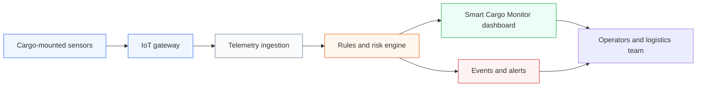
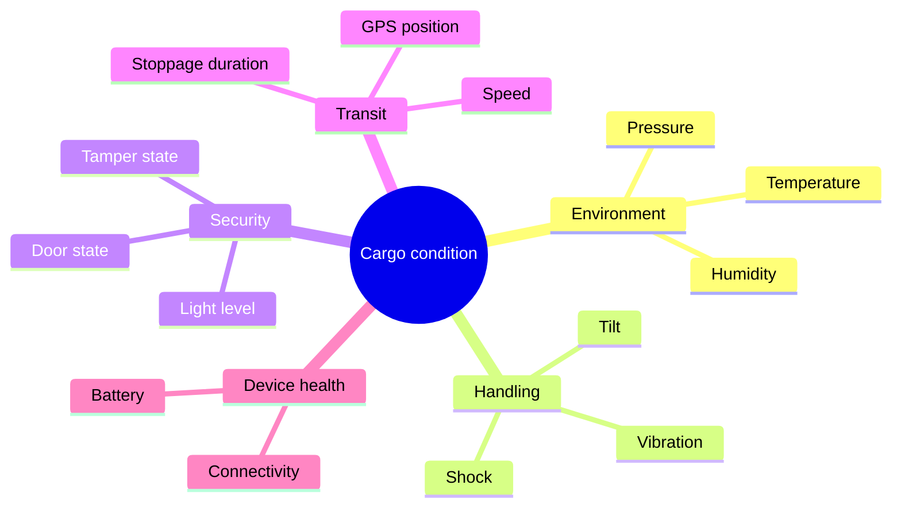
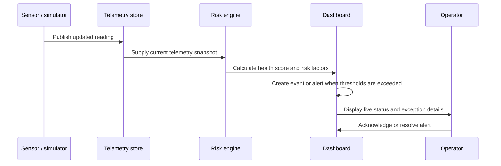

# Smart Cargo Monitor

> A real-time digital-twin dashboard for monitoring the condition, security, and movement of sensitive cargo in transit.

Smart Cargo Monitor is an academic IoT-focused web demonstrator for intelligent cargo supervision. It brings simulated sensor telemetry, GPS tracking, risk assessment, event handling, and a visual cargo-container twin into one operational dashboard. The project is designed around cold-chain and high-value shipments, where a temperature excursion, impact, unauthorized opening, or prolonged stoppage can compromise cargo integrity.

## Project overview

Traditional shipment tracking answers *where* a vehicle is. Smart Cargo Monitor also helps answer *whether the cargo remains safe*. It continuously represents the state of an in-transit container and turns meaningful deviations into visible, actionable alerts.

The current application runs entirely in the browser using a realistic telemetry simulation engine. Its architecture and data models are intentionally structured so that simulated readings can later be replaced with data from an IoT gateway, message broker, or backend API.



## Key capabilities

| Area | What the application provides |
| --- | --- |
| Digital twin | An interactive 3D cargo-container model with exterior, interior, and sensor views. |
| Environmental monitoring | Live temperature, humidity, and pressure readings with operating-range context. |
| Handling and security | Shock, vibration, tilt, door, light-level, and tamper-status monitoring. |
| Fleet visibility | GPS position, movement status, route progress, checkpoints, and unscheduled-stoppage detection. |
| Risk assessment | A transparent, rule-based cargo-health score and estimated damage probability. |
| Alert workflow | Severity-based alerts that operators can acknowledge and resolve. |
| Analytics and reporting | Historical telemetry charts, event timeline, shipment details, and a print-ready audit report. |
| Demo scenarios | On-demand incident simulation for testing dashboard behaviour and project demonstrations. |

## Monitored telemetry



## How it works

The simulation engine updates telemetry at regular intervals and maintains a short in-memory history. The risk engine evaluates the live state against cargo-safety thresholds, including the following examples:

- Temperature above 8°C for the demonstrated refrigerated cargo profile.
- Humidity outside the preferred operating range.
- High shock or excessive roll angle.
- Door-open or tamper conditions during transit.
- Low battery, lost connectivity, or an extended unscheduled stoppage.

When a condition crosses its relevant threshold, the dashboard records an event and presents an alert with a safe, warning, or critical severity. The operator can inspect the container and route context, acknowledge the notification, and resolve it after review.



## Application sections

| Section | Purpose |
| --- | --- |
| **Overview** | Combines the live digital twin, route map, cargo-health panel, key metrics, sensor cards, and recent events. |
| **Analytics** | Visualizes accumulated temperature, humidity, shock, battery, and speed data. |
| **Events** | Provides a chronological record of operational and security-relevant occurrences. |
| **Alerts** | Supports filtering, acknowledgement, and resolution of active exceptions. |
| **Reports** | Produces a shipment-oriented audit and journey summary that can be printed as a PDF. |
| **Admin** | Lets a user select an actively monitored shipment from the available sample fleet. |

## Demonstration scenarios

Open the floating **Demo Simulation** control in the application to trigger representative conditions:

| Scenario | Demonstrated behaviour |
| --- | --- |
| Normal transit | Stable readings, continuous route movement, and healthy cargo status. |
| Temperature excursion | A cold-chain breach followed by simulated corrective recovery. |
| Unscheduled stoppage | A stationary vehicle beyond the configured duration threshold. |
| Door open / tamper | A security event based on door and light/tamper signals. |
| Shock, rough handling, or tilt | Handling-risk readings that affect the cargo-health assessment. |
| Battery depletion | Reduced gateway power and increased telemetry-loss risk. |

## Technology stack

- **Frontend:** React 19, TypeScript, and Vite
- **Styling:** Tailwind CSS
- **State management:** Zustand
- **3D digital twin:** Three.js, React Three Fiber, and Drei
- **Maps:** MapLibre GL
- **Data visualization:** Recharts
- **Interaction and animation:** Framer Motion and React Spring

## Getting started

### Prerequisites

- Node.js 20 or later
- npm 10 or later

### Run locally

```bash
git clone <repository-url>
cd ISA-Project
npm install
npm run dev
```

Vite will print the local development address (normally `http://localhost:5173`).

### Available commands

| Command | Description |
| --- | --- |
| `npm run dev` | Starts the development server with hot reload. |
| `npm run build` | Performs TypeScript checks and creates an optimized production build. |
| `npm run preview` | Serves the generated production build locally. |
| `npm run lint` | Runs Oxlint checks. |

## Project structure

```text
src/
├── components/       # Dashboard UI, 3D twin, map, sensor, event, and demo controls
├── demo/             # Shipment route data and telemetry simulation engine
├── hooks/            # Cargo-health and risk-calculation logic
├── pages/            # Overview, analytics, events, alerts, reports, and admin views
├── store/            # Zustand stores for telemetry, events, UI, and demo state
├── types/            # Shared TypeScript domain models
├── App.tsx           # Routing and simulation lifecycle
└── main.tsx          # Application entry point
```

## Current scope and future integration

This repository is a frontend demonstrator: telemetry, alerts, historical data, and shipment records are held in client-side state and are reset on refresh. The dashboard does **not** yet connect to physical sensors, a database, user authentication, or a production notification service.

For a production-ready implementation, the next steps would be to connect an IoT gateway to a secure ingestion API or MQTT broker, persist telemetry and audit events in a backend database, add role-based access control, and integrate operator notifications through email, SMS, or a logistics platform.

## Academic context

Developed as an **Intelligent Sensor and Actuator** laboratory project. The system demonstrates how sensor fusion, threshold-based reasoning, digital-twin visualization, and event-driven monitoring can improve visibility and response for sensitive cargo logistics.
